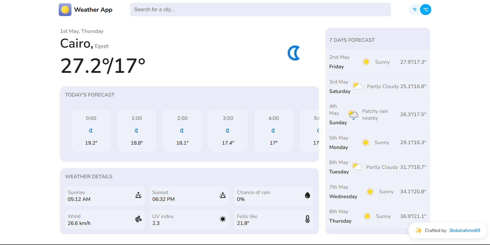

# 🌤️ Weather App

A responsive weather application built with **Vanilla JavaScript**, **HTML**, and **CSS** for the **ITI-R3-Zag** program.  
It allows users to search for a city and view detailed **real-time weather conditions**, **hourly forecasts**, and a **7-day outlook** using the [WeatherAPI.com](https://www.weatherapi.com/) service.

---

## 🛠️ Technologies Used

- **HTML5** – Semantic structure and layout
- **CSS3** – Styling and responsive design with Flexbox
- **JavaScript (Vanilla)** – Dynamic rendering, API handling, event-driven logic
- **[WeatherAPI.com](https://www.weatherapi.com/)** – External RESTful API for real-time weather data
- **Git & GitHub** – Version control and deployment via GitHub Pages

---

## 🔍 Features

- 🔎 **City Search**: Type in any location to get current weather updates.
- 🌡️ **Real-Time Conditions**: View temperature, weather type (e.g., clear, sunny), and "feels like" readings.
- 🕒 **24-Hour Forecast**: Hour-by-hour temperature breakdown for today.
- 📆 **7-Day Forecast**: Extended weather outlook with icons and temperatures.
- 🌅 **Weather Details**:
  - Sunrise & Sunset
  - Chance of Rain
  - Wind Speed
  - UV Index
  - Feels Like Temperature

---

## 🚀 Demo

🔗 [Live Demo](https://3bdulrahmn69.github.io/weather-app-iti)

---

## 🖼️ UI Preview

---

## 🙋‍♂️ Author

- **Name**: Abdulrahman Moussa
- **Email**: [abdulrahmanmoussa69@gmail.com](mailto:abdulrahmanmoussa69@gmail.com)
- **GitHub**: [3bdulrahman69](https://github.com/3bdulrahmn69)
- **LinkedIn**: [3bdulrahman69](https://www.linkedin.com/in/3bdulrahman69)
